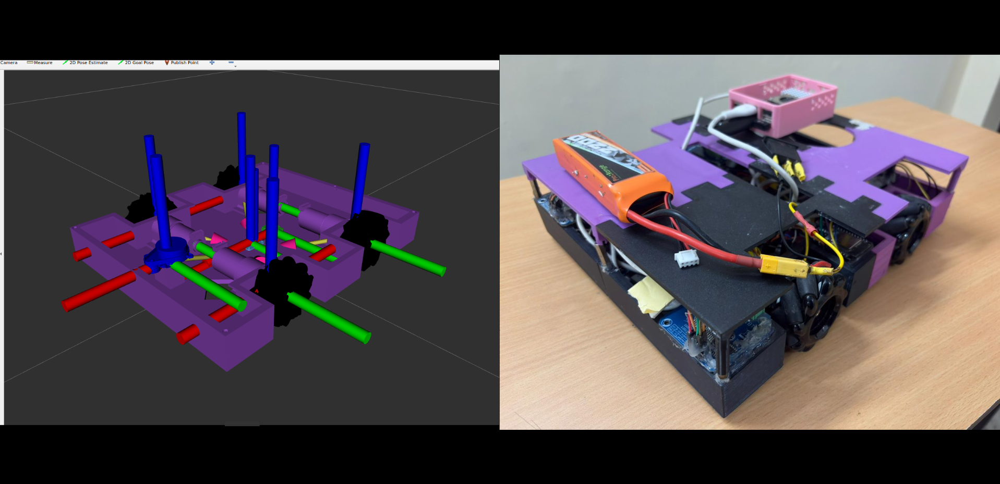

<br />
<div align="center">
 <h3 align="center">HELIOS: Holonomic-Mecanum-Robot</h3>

 <p align="center">
  <a href="images/helios.png">
    
  </a>
</p>

  <p align="center">
    This is the repo for the <a href="https://github.com/iAdityaDev/HELIOS-Holonomic-Mecanum-Robot.git">Four-Mecanum-Wheeled-AMR</a> Project, Built a holonomic mecanum-wheeled robot capable of precise omnidirectional motion, leveraging ROS 2, SLAM, and sensor fusion for robust autonomous navigation in constrained indoor environments.
    <p align="center">
    This is the common repository for both Hardware and On-Simulation development of this Project
    </p>
  </p>
</div>
<br />

## About the Project
This project focuses on developing a ROS 2-based simulation and deployment framework for a mecanum-wheeled holonomic robot.
It demonstrates omnidirectional motion control, along with integration of SLAM and sensor fusion for accurate localization.
The system leverages robot_localization and Nav2 for state estimation and autonomous navigation in indoor environments.
Additionally, it provides a complete pipeline from simulation to real-world hardware, ensuring reliable and scalable deployment.

### Built With
* [](https://ubuntu.com/)
* [](https://www.python.org/)
* [](https://www.sphinx-docs.org)
* [](https://navigation.ros.org/)
* [](https://www.docker.com/)
  
## Getting started
Follow these instructions to set up this project on your system.

### Prerequisites

* ROS Humble
Refer to the official [ROS 2 installation guide](https://docs.ros.org/en/jazzy/Installation.html)
* Gazebo Harmonic
Refer to the official [Gazebo installation guide](https://gazebosim.org/docs/harmonic/getstarted/)

### Installation
 
 1. Make a new workspace
    ```bash
    mkdir -p helios_ws/src
    ```
    
2. Clone the  repository

    Now go ahead and clone this repository inside the "src" folder of the workspace you just created.

      ```bash
      cd helios_ws/src
      git clone https://github.com/iAdityaDev/HELIOS-Holonomic-Mecanum-Robot.git
      ```

3. Compile the package

    Follow this execution to compile your ROS 2 package
  
      ```bash
      colcon build --symlink-install
      ```

4. Source your workspace
      ```bash
      source install/local_setup.bash
      ```
## Docker Setup
Instead of setting up all prerequisites on your local machine, you can run the entire project using Docker for a consistent and hassle-free environment.
* Setup Docker
  Refer to the official [Docker setup_guide](https://docs.docker.com/engine/install/ubuntu/)
  
1. Clone and navigate to the repository
      ```bash
      cd helios_ws/src/HELIOS-Holonomic-Mecanum-Robot
      ```
      
2. Build the docker Image
      ```bash
      docker build -t helios_image .
      ```
      
3. Run Docker Container (with Workspace Mounted)
      ```bash
    docker run -it --net=host \
    -e ROS_DOMAIN_ID=10 \
    -v $HOME/your_workspace/:/workspace/ \
    -v /tmp/.X11-unix:/tmp/.X11-unix \
    -e DISPLAY=$DISPLAY \
    --name helios_container \
    helios_image:latest
<!--
## Usage
Our package consists of three directories as follows:-

- The `mr_robot_description` dir contains all the bot model description files.
- The `mr_robot_gazebo` dir contains all the world description files.
- The `mr_robot_navigation` dir contains all the config files for enabling navigation and planning.

### 1. Launch navigation
Spawns our robot in a custom gazebo world along with all the necessary plugins. It also launches navigation
```bash
ros2 launch mr_robot_navigation gps_waypoint_follower.launch.py use_rviz:=True
```
**_NOTE:_** Make sure that you have installed the navigation dependencies before running the navigation launch file.<br />

### 2. Mapviz
[Docker image for tile map](https://github.com/danielsnider/MapViz-Tile-Map-Google-Maps-Satellite)<br />
* Launches mapviz GUI 
```bash
ros2 launch mr_robot_navigation mapviz.launch.py
```


### 3. Run interactive_waypoint_follower script
This script makes the robot navigate to the clicked waypoint in mapviz
```bash
ros2 run mr_robot_navigation interactive_waypoint_follower
```

### 4. Run gps_waypoint_logger script
Opens up a GUI to save the robot current coordinates and heading on demand to a yaml file 
```bash
ros2 run mr_robot_navigation gps_waypoint_logger
```

### 5. Run logged_waypoint_follower script
Robot navigates through previously logged waypoints
```bash
ros2 run mr_robot_navigation logged_waypoint_follower
```


https://github.com/user-attachments/assets/89ecf916-f9e9-4ee3-bdf6-f13138252aca


-->


## Contributing

We wholeheartedly welcome contributions!  
They are the driving force that makes the open-source community an extraordinary space for learning, inspiration, and creativity. Your contributions, no matter how big or small, are **genuinely valued** and **highly appreciated**.

1. Fork the Project
2. Create your Feature Branch (`git checkout -b feature/New-Feature`)
3. Commit your Changes (`git commit -m 'Add some New-Feature'`)
4. Push to the Branch (`git push origin feature/New-Feature`)
5. Open a Pull Request

Please adhere to this project's `code of conduct`.

## License

[APACHE 2.0](https://choosealicense.com/licenses/apache-2.0/)

## Contact Us

If you have any feedback, please reach out to us at:  

## Acknowledgments

* [ROS Official Documentation](http://wiki.ros.org/Documentation)
* [Gazebo Tutorials](https://classic.gazebosim.org/tutorials)
* [Ubuntu Installation guide](https://ubuntu.com/tutorials/install-ubuntu-desktop#1-overview)
* [Docker installation guide](https://docs.docker.com/engine/install/ubuntu/)
* [Nav2 official documentation](https://docs.nav2.org/index.html)
* [Mapviz official installation](https://swri-robotics.github.io/mapviz/)


